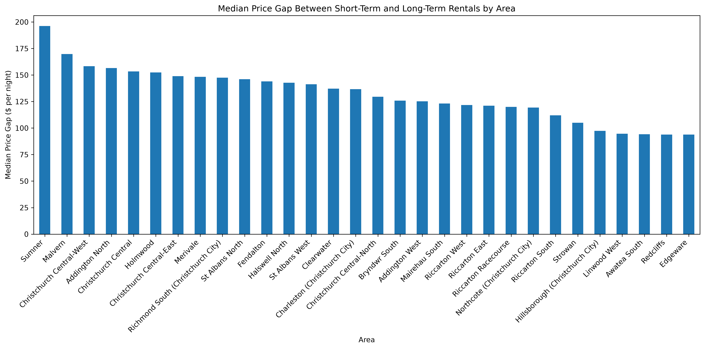
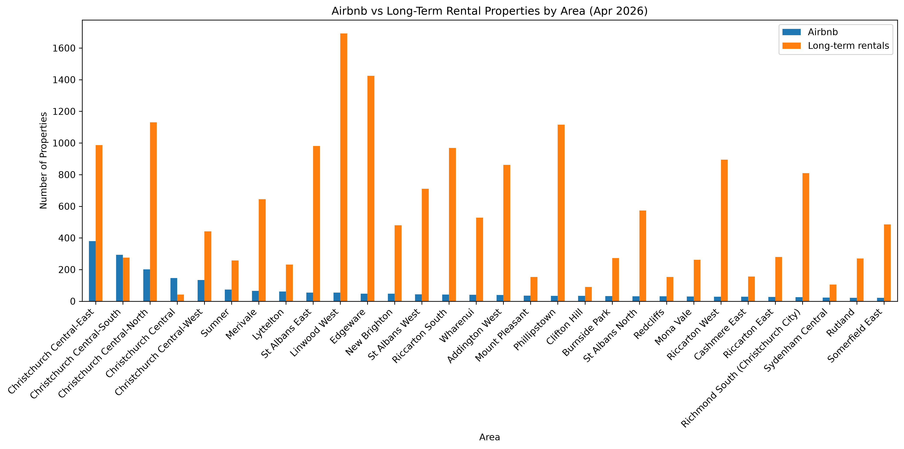

# DATA201-DATA422 Data Wrangling Project - Group 6

## Dataset 1

**Source:** https://insideairbnb.com/get-the-data/ New Zealand, 19th of June 2026

**Number of rows:** 50932 without the header\
**Number of columns:** 18\
**Column 1:** id --> id of the listing\
**Column 2:** name --> AirBnB name on the listing\
**Column 3:** host_id\
**Column 4:** host_name\
**Column 5:** neighbourhood_group --> city district\
**Column 6:** neighbourhood --> actual neighbourhood\
**Column 7:** latitude\
**Column 8:** longitude\
**Column 9:** room_type --> entire home or just private room\
**Column 10:** price\
**Column 11:** minimum_nights\
**Column 12:** number_of_reviews\
**Column 13:** last_review\
**Column 14:** reviews_per_month\
**Column 15:** calculated_host_listings_count --> how many listings the host has\
**Column 16:** availability_365 --> when is it available\
**Column 17:** number_of_reviews_ltm --> number of reviews in the last 12 month\
**Column 18:** license --> permit/registration number

## Dataset 2

**Source:** [Tenancy Services – Rental Bond Data](https://www.tenancy.govt.nz/about-tenancy-services/data-and-statistics/rental-bond-data/)

**Number of rows:** 226080 without the header\
**Number of columns:** 12\
**Column 1:** TimeFrame --> The quarter summarised, based on tenancy start date\
**Column 2:** Location Id --> Geographic area code. Per the source, area definitions use the SA2-2019 classification from Statistics NZ\
**Column 3:** Dwelling Type --> Type of rental property (ALL, House, Apartment, Boarding house, Flat)\
**Column 4:** Number Of Beds --> Bedroom count category\
**Column 5:** Total Bonds --> Number of tenancies which has been opened within the timeframe\
**Column 6:** Active Bonds --> Number of tenancies still ongoing\
**Column 7:** Closed Bonds --> Number of tenancies that have ended\
**Column 8:** Median Rent --> Middle weekly rent value for the group\
**Column 9:** Geometric Mean Rent --> Alternative measure to the median, used because rents cluster at round numbers, which can make plain medians plateau over time\
**Column 10:** Upper Quartile Rent --> Synthetic 75th-percentile rent, modelled assuming a log-normal rent distribution\
**Column 11:** Lower Quartile Rent --> Synthetic 25th-percentile rent, modelled assuming a log-normal rent distribution\
**Column 12:** Log Std Dev Weekly Rent --> Standard deviation of the log of weekly rent, indicating how spread out rents are within the group\

## Rental Bond Data Cleaning

### Before Data Cleaning (All Data): Rental Bond Dataset
The original dataset contained 226,080 records and 12 columns.\
Dataset shape: (226080, 12)

### Data types
TimeFrame                      str\
Location Id                float64\
Dwelling Type                  str\
Number Of Beds                 str\
Total Bonds                  int64\
Active Bonds                 int64\
Closed Bonds                 int64\
Median Rent                float64\
Geometric Mean Rent        float64\
Upper Quartile Rent        float64\
Lower Quartile Rent        float64

### Update column data types
Convert TimeFrame from string to datetime

### Apply Timeframe filter
Kept 27,212 of 226,080 rows (2025-10-01 to 2026-04-30)

### Retaining All Relevant Columns
All relevant columns were retained, and no columns were dropped.\
Log Std Dev Weekly Rent was retained as it provides insight into rent variability within a group, complementing other rent metrics.\
Dataset shape: (27212, 12)

### Duplicate Records
Duplicate records were checked across all columns in the dataset.\
Result:\
- Duplicate rows found: 0\
No duplicate records were identified; therefore, no duplicate rows were removed.

### Missing Location Id
94 records out of a total of 27,212 with missing Location Id were retained
because they represent only 0.35% of the dataset. These records also have missing
values in Median Rent, Geometric Mean Rent, Upper Quartile Rent, and Lower
Quartile Rent. However, they still contain valid information in Dwelling Type,
Number Of Beds, Total Bonds, Active Bonds, and Closed Bonds.

### Number Of Beds Imputation

#### Create Reference Records
A reference table was created using records with valid Location Id and Number Of Beds. This table is used to identify matching Number Of Beds values based on Location Id, Dwelling Type, and Median Rent for imputation purposes.

#### Validate Reference Combinations
Calculate the number of unique Number Of Beds values for each Location Id, Dwelling Type, and Median Rent combination.
- Unique_Bed_Count = 1 indicates the combination can be used as a reference for imputation.
- Unique_Bed_Count > 1 indicates the combination cannot be used as a reference for imputation.

#### Identify Missing Combinations
Identify unique combinations with missing Number Of Beds that have a valid
Location Id for imputation.

#### Perform Imputation
- Keep a copy of the original Number Of Beds values before imputation.
- Loop through records with missing Number Of Beds and a valid Location Id.
- Find matching reference records using Location Id, Dwelling Type, and Median Rent.
- Impute Number Of Beds only when exactly one matching reference record is found.

#### Results
- Missing Number Of Beds before imputation: 890
- Missing Number Of Beds after imputation: 722
- Number Of Beds values imputed: 168

#### Sanity Check
Displayed records where Number Of Beds was updated during imputation by comparing the original values stored in Org_Number_Of_Beds with the imputed values in Number Of Beds.

### Check for invalid values
No negative values were found in the bond or rent columns.\
A review of the bond variables showed that Total Bonds, Active Bonds, and Closed Bonds represent different aspects of bond activity within a quarter. Total Bonds refers to bonds lodged during the quarter, while Active Bonds and Closed Bonds represent bond status counts during the quarter. Therefore, direct comparisons between these variables were not used as a data quality rule.

### Outlier Detection
Potential outliers were identified using the IQR (Interquartile Range) method across the numerical variables.

Outlier percentages ranged from 4.14% to 7.89% of the dataset.
As the dataset contains rental bond and rent information, extreme values may represent genuine observations rather than data quality issues. Therefore, the identified outliers were retained in the dataset.

#### Clean Up
The temporary column Org_Number_Of_Beds, created to preserve the original values
of Number Of Beds for validation and sanity checking during imputation, was
dropped after the imputation process was verified.

After completing the data cleaning process, the cleaned dataset was saved.

## Median Airbnb Price in Christchurch Central

Christchurch Central was identified using **Location ID 326600**.

The Airbnb dataset was filtered using the corresponding `area_code`, and the
median listing price was calculated from the `price` column.

**Median Airbnb price in Christchurch Central: $239.00 per night**

The median was used rather than the mean because Airbnb prices can contain
extreme values that may distort the average.

## Short-term vs Long-term Rental Price Gap

To compare short-term and long-term rental prices, Airbnb listings with a
`minimum_nights` value of 7 or less were treated as short-term rentals.

The weekly median rent from the rental bond dataset was converted to a nightly
price:

`long-term nightly price = Median Rent / 7`

The rental price gap was then calculated as:

`price gap = Airbnb nightly price - long-term nightly price`

To reduce the influence of extreme Airbnb price outliers, the median price gap
was calculated for each area. Only areas with at least 10 unique listings were
included.

The largest median gap was observed in **Sumner**, with a median short-term
premium of approximately **$196 per night** across **78 listings**.

The next largest gaps were observed in:
- **Malvern:** ~$170 per night
- **Christchurch Central-West:** ~$158 per night
- **Addington North:** ~$157 per night
- **Christchurch Central:** ~$153 per night

## Number of Airbnb vs Long-Term Rental Properties for each location

To compare the number of Airbnb and long-term rental properties across Christchurch, the Airbnb and Rental Bond datasets were aligned by geographic area and quarter.

Airbnb monthly observations were converted to quarter start dates so they could be matched with the quarterly `TimeFrame` values in the Rental Bond dataset.

For Airbnb listings, the number of unique `id` values was counted for each area and quarter.

For long-term rentals, the Rental Bond dataset was filtered to:

- `Dwelling Type = ALL`
- `Number Of Beds = ALL`

The `Active Bonds` value was then used as the number of active long-term rental tenancies for each area.

The geographic match was performed using:

- Airbnb `area_code`
- Rental Bond `Location Id`

The comparison was carried out separately for each quarter to avoid mixing observations from different time periods.

The latest available quarter was **April–June 2026**.

