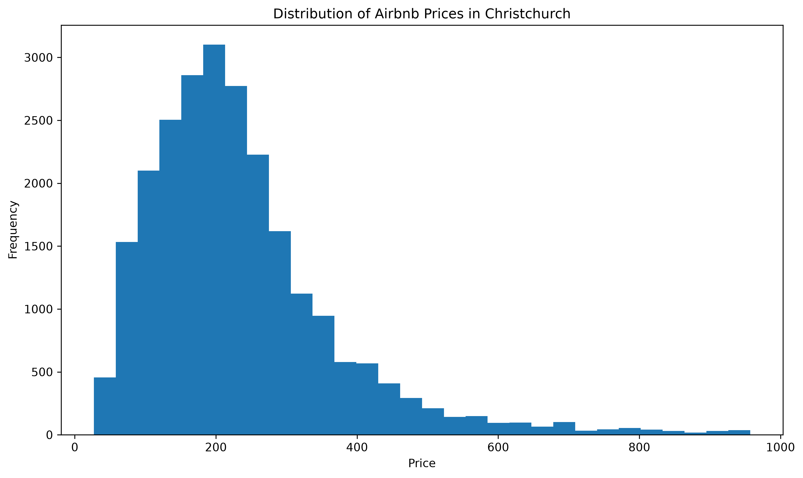
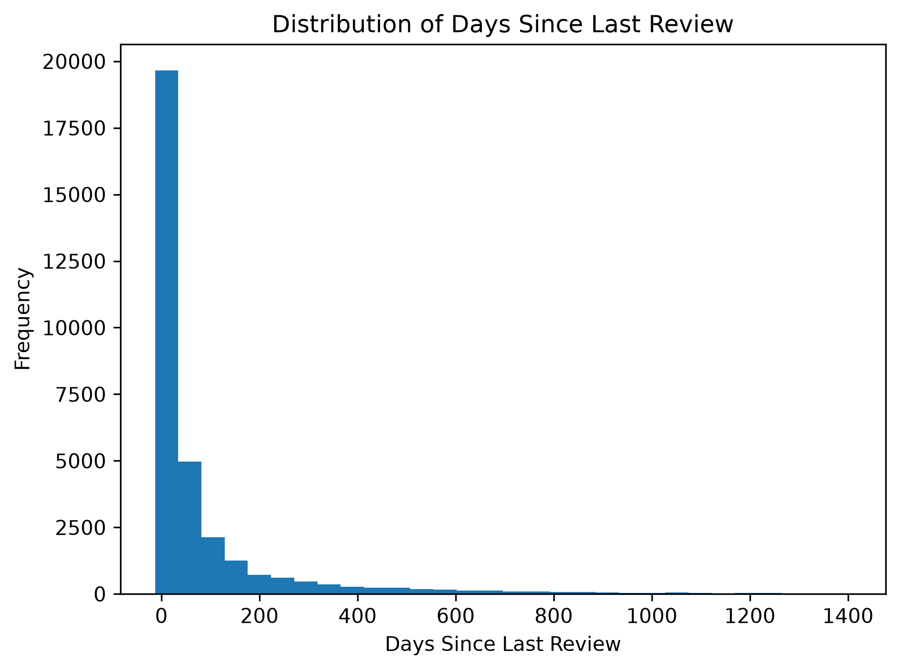
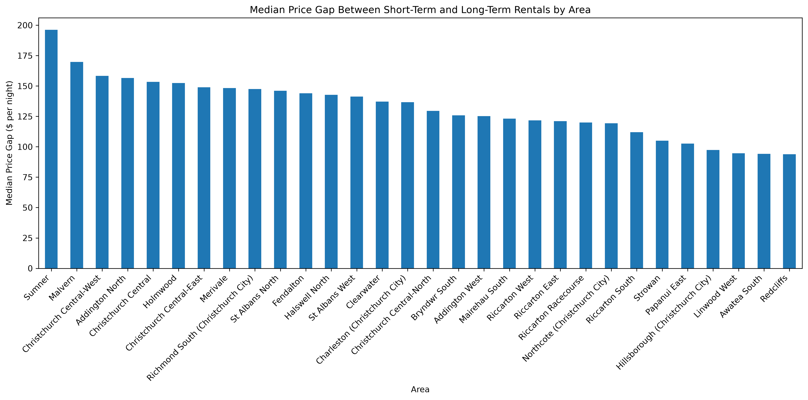
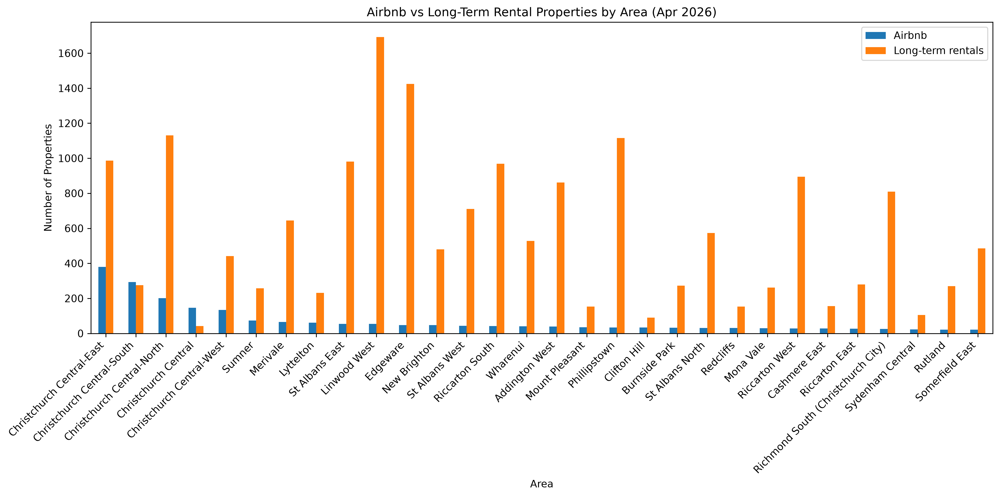

# DATA201-DATA422 Data Wrangling Project - Group 6

This project combines Airbnb listing data with New Zealand Rental Bond data
to compare short-term and long-term rental patterns across Christchurch.

The analysis focuses on rental prices, geographic differences, and the number
of properties available in different Statistical Area 2 (SA2) locations.

---

## Automated Data Pipeline

The complete data wrangling workflow was automated to make the analysis
reproducible and easy to update when new Airbnb monthly data become available.

The pipeline:

1. Detects the monthly Airbnb CSV files in the `data` folder.
2. Filters the Airbnb data to Christchurch City.
3. Combines the monthly Airbnb snapshots and assigns their corresponding
   scrape/publish dates.
4. Cleans the Christchurch Airbnb dataset.
5. Cleans and validates the Rental Bond dataset.
6. Matches Airbnb coordinates to Statistical Area 2 (SA2) locations using
   the Koordinates API.
7. Combines Airbnb and Rental Bond data where required for the analyses.
8. Runs the Airbnb and rental analyses.
9. Updates the output plots.

The complete workflow can be executed with a single command:

```bash
python src/run_pipeline.py
```
### SA2 Coordinate Lookup and Caching

Airbnb listings are matched to Statistical Area 2 (SA2) locations using their
latitude and longitude coordinates and the Koordinates API.

To avoid repeating API requests every time the pipeline is executed, previously
matched coordinates are stored in:

`out/area_code_lookup.csv`

When the pipeline is run again, the existing lookup table is loaded and only
coordinates that have not previously been matched are sent to the Koordinates
API. The stored and newly retrieved results are then used to assign `area_code`
and `area_name` to the complete Airbnb dataset.

This makes subsequent pipeline runs faster and avoids unnecessary API requests
when adding new monthly Airbnb data.

---

## Dataset 1 — Airbnb Listings

**Source:** [Inside Airbnb](https://insideairbnb.com/get-the-data/)  
**Location:** Christchurch, New Zealand  
**Period analysed:** October 2025 – August 2026  
**Columns:** 18

| Column | Description |
|---|---|
| `id` | Unique Airbnb listing identifier |
| `name` | Listing name |
| `host_id` | Unique host identifier |
| `host_name` | Host name |
| `neighbourhood_group` | Higher-level geographic grouping |
| `neighbourhood` | Neighbourhood of the listing |
| `latitude` | Listing latitude |
| `longitude` | Listing longitude |
| `room_type` | Type of accommodation, such as entire home or private room |
| `price` | Airbnb nightly price |
| `minimum_nights` | Minimum number of nights required for a booking |
| `number_of_reviews` | Total number of reviews |
| `last_review` | Date of the most recent review |
| `reviews_per_month` | Average number of reviews per month |
| `calculated_host_listings_count` | Number of listings associated with the host |
| `availability_365` | Number of days available during the next 365 days |
| `number_of_reviews_ltm` | Number of reviews in the last 12 months |
| `license` | Permit or registration information |

Monthly Airbnb snapshots were combined to create a longitudinal dataset.
Each raw file is automatically identified from its filename (for example,
`Aug2026.csv`), filtered to Christchurch City, and assigned its corresponding
scrape/publish date.

---

## Airbnb Data Cleaning

The Airbnb dataset had already been filtered to Christchurch before the main
analysis. The cleaning process focused on retaining variables relevant to
rental price, availability, property type, and geographic analysis.

### Removed columns

The following columns were removed because they were not required for the
planned analysis:

- `name`
- `host_name`
- `neighbourhood_group`
- `last_review`
- `reviews_per_month`
- `number_of_reviews_ltm`
- `license`

`neighbourhood_group` was removed because the dataset had already been filtered
to Christchurch, so it did not provide useful additional geographic variation.

Latitude and longitude were retained for geographic matching.

### Missing values

Most retained variables contained no missing values.

The main exceptions were:

- `price`: 10,667 missing values
- `minimum_nights`: 37 missing values

Rows with missing prices were retained because a listing may still be useful
when analysing the number and geographic distribution of Airbnb properties.
Missing prices are excluded only when a price-specific analysis is performed.

The small number of missing `minimum_nights` values was also retained because
this variable was not required for every analysis.

### Duplicate checks

No completely duplicated rows were found.

Although some Airbnb `id` values appeared multiple times, this was expected
because the dataset contains observations from multiple dates.

The combination of `id` and `date` was checked and no duplicate
`id`–`date` records were found.

### Invalid values and outliers

The following checks were performed:

- `availability_365` was confirmed to fall between 0 and 365
- `minimum_nights` contained no values below 1
- `price` contained no zero or negative values
- latitude and longitude values were retained for geographic analysis

Airbnb prices contained several extreme values. These observations were
retained because there was no objective threshold for identifying them as
incorrect records.

For later price comparisons, median values were therefore preferred over means
where appropriate because they are less sensitive to extreme prices.

---

## Dataset 2 — Rental Bond Data

**Source:** [Tenancy Services — Rental Bond Data](https://www.tenancy.govt.nz/about-tenancy-services/data-and-statistics/rental-bond-data/)  
**Original size:** 226,080 rows × 12 columns

| Column | Description |
|---|---|
| `TimeFrame` | Quarter summarised, based on tenancy start date |
| `Location Id` | SA2 geographic area identifier |
| `Dwelling Type` | Rental property category such as house, apartment, flat, or boarding house |
| `Number Of Beds` | Bedroom-count category |
| `Total Bonds` | Number of tenancies opened during the timeframe |
| `Active Bonds` | Number of tenancies still active |
| `Closed Bonds` | Number of tenancies that have ended |
| `Median Rent` | Median weekly rent for the group |
| `Geometric Mean Rent` | Alternative rental-price measure using the geometric mean |
| `Upper Quartile Rent` | Estimated 75th-percentile weekly rent |
| `Lower Quartile Rent` | Estimated 25th-percentile weekly rent |
| `Log Std Dev Weekly Rent` | Measure of the spread of weekly rental prices |

---

## Rental Bond Data Cleaning

### Initial dataset

The original Rental Bond dataset contained:

- **226,080 rows**
- **12 columns**

### Data types

`TimeFrame` was converted from a string to a datetime value so that the dataset
could be filtered and aligned with the Airbnb observation periods.

### Timeframe filtering

Only the period relevant to the Airbnb analysis was retained:

**1 October 2025 to 30 April 2026**

This reduced the dataset from:

**226,080 rows → 27,212 rows**

All 12 columns were retained because they contained potentially useful
information for rental-price and property-count analyses.

### Duplicate records

Duplicate rows were checked across all columns.

**Duplicate rows found: 0**

No records were removed as duplicates.

### Missing `Location Id`

There were **94 rows** with missing `Location Id`, representing approximately
**0.35%** of the filtered dataset.

These rows were retained because they still contained useful information for:

- `Dwelling Type`
- `Number Of Beds`
- `Total Bonds`
- `Active Bonds`
- `Closed Bonds`

The same records also contained missing rent statistics, including `Median Rent`,
`Geometric Mean Rent`, `Upper Quartile Rent`, and `Lower Quartile Rent`.

### `Number Of Beds` imputation

The dataset initially contained **890 missing values** in `Number Of Beds`.

A reference table was created from records containing valid values for:

- `Location Id`
- `Dwelling Type`
- `Median Rent`
- `Number Of Beds`

For each combination of `Location Id`, `Dwelling Type`, and `Median Rent`, the
number of unique bedroom categories was checked.

A missing `Number Of Beds` value was imputed only when the matching combination
mapped to exactly one bedroom category.

#### Imputation results

- Missing before imputation: **890**
- Values successfully imputed: **168**
- Missing after imputation: **722**

The original values were temporarily preserved in `Org_Number_Of_Beds` so that
the imputed records could be validated. This temporary column was removed after
the validation was completed.

#### Sanity check
A review was performed on 10% of the imputed records by comparing the imputed Number Of Beds value against the corresponding lookup record used during imputation.

- Number Of Beds imputation errors found in sanity check: **0**
- Sanity check accuracy for the reviewed 10% of imputed records: **100.00%**

### Invalid values

No negative values were found in the bond-count or rental-price variables.

`Total Bonds`, `Active Bonds`, and `Closed Bonds` were not directly compared as
a consistency rule because they represent different aspects of bond activity.

### Outlier detection

Potential outliers in the numerical variables were identified using the
Interquartile Range (IQR) method.

Depending on the variable, approximately **4.14% to 7.89%** of observations were
identified as potential outliers.

These observations were retained because high bond counts or rental prices may
represent genuine characteristics of particular areas rather than data errors.

### Cleaned output

After the cleaning and validation steps were completed, the processed Rental
Bond dataset was saved for use in the subsequent analyses.

---

## Project Structure

The project is organised into separate scripts for data preprocessing,
geographic matching, analysis, and pipeline orchestration.

```text
data/
    Monthly Airbnb CSV files
    Rental Bond dataset

out/
    filtered_dataset.csv
    christchurch_listings_clean.csv
    christchurch_listings_with_area_codes.csv
    bond_data_clean.csv
    area_code_lookup.csv
    images/

src/
    data_filtering.py
    clean_filtered_dataset_chch.py
    rental_bond_data_cleaning.py
    get_area_codes.py
    join_datasets.py
    airbnb_analysis.py
    rental_analysis.py
    compare_location.py
    median_price.py
    run_pipeline.py
```

### Scripts

| Script | Purpose |
|---|---|
| `data_filtering.py` | Detects, filters, and combines the monthly Airbnb datasets |
| `clean_filtered_dataset_chch.py` | Cleans and validates the Christchurch Airbnb data |
| `rental_bond_data_cleaning.py` | Cleans and validates the Rental Bond dataset |
| `get_area_codes.py` | Matches Airbnb coordinates to SA2 locations and manages the coordinate lookup cache |
| `join_datasets.py` | Joins Airbnb and Rental Bond data by geographic area and observation period |
| `airbnb_analysis.py` | Performs Airbnb price and review analyses |
| `rental_analysis.py` | Compares short-term Airbnb prices with long-term rental prices |
| `compare_location.py` | Compares the number of Airbnb and long-term rental properties by area |
| `median_price.py` | Calculates the median Airbnb price in Christchurch Central |
| `run_pipeline.py` | Orchestrates the complete data wrangling and analysis workflow |

---

## How to Run the Project

1. Place the required raw datasets in the `data` folder:
   - Monthly Airbnb `listings.csv` files, renamed using the `MonYYYY.csv`
     format (for example, `Jul2026.csv` or `Aug2026.csv`)
   - The Rental Bond dataset

2. Ensure that the required Python packages are installed.

3. Configure a valid Koordinates API key for the geographic matching step.
   The API key should not be committed to the repository.

4. Create a `.env` file in the project root and add your Koordinates API key:

   `KOORDINATES_API_KEY=your_api_key`

5. Run the complete pipeline from the project root:

```bash
python src/run_pipeline.py
```

The pipeline will automatically preprocess the datasets, perform the geographic
matching, run the analyses, and update the generated outputs and plots in the
`out` folder.

For a new Airbnb month, its corresponding scrape/publish date must also be
added to the `scrape_dates` dictionary in `data_filtering.py`, since this
information is not included in the downloaded Airbnb CSV file.

---

## Design Principles and Coding Best Practices

This section documents the main design decisions adopted when reviewing and
automating the project pipeline, following the coding practices discussed in
Week 9.

### Pipeline Inputs and Outputs

The pipeline was designed to start from the raw datasets and reproduce the
processed datasets, analyses, and visual outputs without requiring the
individual scripts to be executed manually.

#### Inputs

The main pipeline inputs are:

- Monthly Airbnb `listings.csv` files downloaded from Inside Airbnb and renamed
  using the `MonYYYY.csv` format (for example, `Aug2026.csv`).
- The corresponding Airbnb scrape/publish dates, stored in the `scrape_dates`
  dictionary because these dates are not included in the downloaded CSV files.
- The New Zealand Rental Bond dataset from Tenancy Services.
- A Koordinates API key, stored outside the source code in a `.env` file and
  used to retrieve SA2 geographic information when required.

#### Outputs

The pipeline produces a set of intermediate and final outputs in the `out`
folder, including:

- `filtered_dataset.csv` — combined monthly Airbnb data filtered to
  Christchurch City.
- `christchurch_listings_clean.csv` — cleaned Airbnb data.
- `area_code_lookup.csv` — cached coordinate-to-SA2 matches.
- `christchurch_listings_with_area_codes.csv` — Airbnb data enriched with
  SA2 area codes and names.
- `bond_data_clean.csv` — cleaned Rental Bond data.
- Updated analysis plots stored in `out/images/`.

The processed datasets are used by the analysis scripts to calculate Airbnb
price and review statistics, compare short-term and long-term rental prices,
compare property counts by area, and calculate the median Airbnb price in
Christchurch Central.

### Pipeline Design and Main Steps

The pipeline follows a modular design in which each script is responsible for
a specific stage of the data wrangling or analysis process. The individual
processing functions are orchestrated by `run_pipeline.py`, allowing the
complete workflow to be executed with a single command.

The main stages are:

1. **Airbnb filtering and integration** — monthly Airbnb files are detected,
   filtered to Christchurch City, assigned their scrape/publish dates, and
   combined into a single dataset.

2. **Airbnb cleaning** — unnecessary columns are removed and data quality
   checks are performed while retaining observations that may still be useful
   for non-price analyses.

3. **Rental Bond cleaning** — the Rental Bond data are filtered to the required
   timeframe, checked for invalid or duplicate records, and missing bedroom
   values are imputed only when a unique match can be identified.

4. **Geographic enrichment** — Airbnb coordinates are matched to SA2 area codes
   and names using the Koordinates API. Previously retrieved matches are reused
   through the coordinate lookup cache.

5. **Data integration** — Airbnb and Rental Bond data are aligned by geographic
   area and observation period where required.

6. **Analysis and output generation** — the processed data are used to perform
   the Airbnb and rental analyses and regenerate the output plots.

This structure separates data processing, external API access, data integration,
and analysis into distinct components. It also allows individual stages to be
tested or executed independently while maintaining a single entry point for the
complete workflow.

### Coding Best Practices and Changes

As part of the Week 9 code review, the project was revisited to improve
readability, maintainability, reproducibility, and automation. The following
high-level changes were made:

- **Modular functions:** Processing and analysis steps were organised into
  reusable functions rather than relying on code that executes automatically
  when a script is imported. This makes individual stages easier to test,
  reuse, and orchestrate.

- **Main guards:** Scripts use `if __name__ == "__main__":` so that they can
  still be executed independently while also being safely imported by the
  pipeline without unintentionally running their processing code.

- **Single pipeline entry point:** A `run_pipeline.py` script was introduced to
  orchestrate the individual processing and analysis functions. This reduces
  the need for manual execution and ensures that the stages are run in the
  correct order.

- **Removal of interactive steps:** Interactive input was removed from the
  automated workflow where it would interrupt pipeline execution. Diagnostic
  checks are instead performed automatically so that the complete pipeline can
  run without user intervention.

- **Separation of sensitive configuration:** The Koordinates API key was moved
  out of the source code and into a `.env` file. The `.env` file is excluded
  from version control using `.gitignore`, preventing credentials from being
  stored in the repository.

- **Caching external API results:** Coordinate-to-SA2 matches are stored in
  `area_code_lookup.csv`. When the pipeline is run again, only previously unseen
  coordinates are queried through the Koordinates API. This reduces unnecessary
  API requests and improves execution time.

- **Separation of responsibilities:** Filtering, cleaning, geographic matching,
  joining, analysis, and orchestration are kept in separate scripts. This makes
  the purpose of each component clearer and limits the amount of code that must
  be changed when one stage of the workflow is updated.

- **Reproducible file handling:** Monthly Airbnb files follow a consistent
  `MonYYYY.csv` naming convention and are automatically detected and ordered by
  the filtering stage. This makes it easier to incorporate additional monthly
  datasets without rewriting the processing logic.

These changes were intended to make the project easier to understand, maintain,
rerun, and extend while preserving the original analysis decisions.

### Sanity Check Example

One sanity check used in the Airbnb cleaning stage verifies that there are no
duplicate observations for the same listing within the same monthly snapshot.

Since the dataset combines multiple monthly Airbnb files, the same listing `id`
is expected to appear more than once across the complete dataset. However, the
combination of `id` and `date` should be unique because each listing should
appear only once within a given monthly snapshot.

The check can be performed using:

```python
duplicate_id_date = df.duplicated(
    subset=["id", "date"]
).sum()

print("Duplicate id-date records:", duplicate_id_date)
```

The expected result is:

```text
Duplicate id-date records: 0
```

A value greater than zero would indicate that one or more monthly files may
contain duplicated listings or that the same monthly data may have been
included more than once in the pipeline. This would need to be investigated
before continuing with the analyses because duplicated observations could
affect property counts and summary statistics.

In the final processed Airbnb dataset, no duplicate `id`–`date` records were
found.

### Use of AI

OpenAI ChatGPT was used during the development and review of this project as a
support tool for discussing coding practices, reviewing the structure of the
data wrangling workflow, troubleshooting code, and refining the documentation.

For the design principles documentation, ChatGPT was used to help organise and
describe the pipeline inputs, outputs, main processing stages, and the
high-level coding strategies adopted during the project.

The final code, design decisions, data-cleaning choices, analyses, and outputs
were reviewed and tested by the project team.

---

## Airbnb Data Analysis

An exploratory analysis was performed on the Christchurch Airbnb listings to examine price patterns, review activity, and highly reviewed properties across the available monthly snapshots.

### Price Distribution

The distribution of Airbnb prices in Christchurch was examined after removing missing price values. Since the dataset contains a small number of very high prices, the plot was restricted to observations below the 99th percentile to improve readability while retaining the majority of the data.



### Days Since Last Review

To examine how recently Airbnb properties had received reviews, a new feature called `days_since_last_review` was calculated as:

`days_since_last_review = scrape/publish date - last_review date`

Because the analysis combines multiple monthly Airbnb snapshots, each month was matched with its corresponding scrape/publish date from Inside Airbnb rather than using a single fixed date for the entire dataset.

The distribution was again displayed up to the 99th percentile to reduce the visual effect of extreme values.



A small number of records produced negative values for `days_since_last_review`. Further inspection showed that these values were generally very small: most were between -1 and -3 days, although the minimum was -13 days. These records were retained rather than modified or removed, as they result directly from the available `last_review` values and the scrape/publish dates reported for each monthly dataset.

### Properties with the Highest Number of Reviews

Properties in the top 10% of `number_of_reviews` were identified to explore the most frequently reviewed Airbnb listings. The analysis reports the number of properties in this group, their total number of reviews, and information about the highest-reviewed listings.

---

## Median Airbnb Price in Christchurch Central

Christchurch Central was identified using **Location ID 326600**.

The Airbnb dataset was filtered using the corresponding `area_code`, and the
median listing price was calculated from the `price` column.

**Median Airbnb price in Christchurch Central: $246.00 per night**

The median was used rather than the mean because Airbnb prices can contain
extreme values that may distort the average.

---

## Short-term vs Long-term Rental Price Gap

To compare short-term and long-term rental prices, Airbnb listings with a
`minimum_nights` value of 7 or less were treated as short-term rentals.

The weekly median rent from the rental bond dataset was converted to a nightly
price:

`long-term nightly price = Median Rent / 7`

The rental price gap was then calculated as:

`price gap = Airbnb nightly price - long-term nightly price`

To reduce the influence of extreme Airbnb price outliers, the median price gap
was calculated for each area. Only areas with at least 10 unique listings were
included.

The largest median gap was observed in **Sumner**, with a median short-term
premium of approximately **$196 per night** across **78 listings**.

The next largest gaps were observed in:
- **Malvern:** ~$170 per night
- **Christchurch Central-West:** ~$158 per night
- **Addington North:** ~$157 per night
- **Christchurch Central:** ~$153 per night



---

## Number of Airbnb vs Long-Term Rental Properties for each location

To compare the number of Airbnb and long-term rental properties across Christchurch, the Airbnb and Rental Bond datasets were aligned by geographic area and quarter.

Airbnb monthly observations were converted to quarter start dates so they could be matched with the quarterly `TimeFrame` values in the Rental Bond dataset.

For Airbnb listings, the number of unique `id` values was counted for each area and quarter.

For long-term rentals, the Rental Bond dataset was filtered to:

- `Dwelling Type = ALL`
- `Number Of Beds = ALL`

The `Active Bonds` value was then used as the number of active long-term rental tenancies for each area.

The geographic match was performed using:

- Airbnb `area_code`
- Rental Bond `Location Id`

The comparison was carried out separately for each quarter to avoid mixing observations from different time periods.

The latest available quarter was **April–June 2026**.

